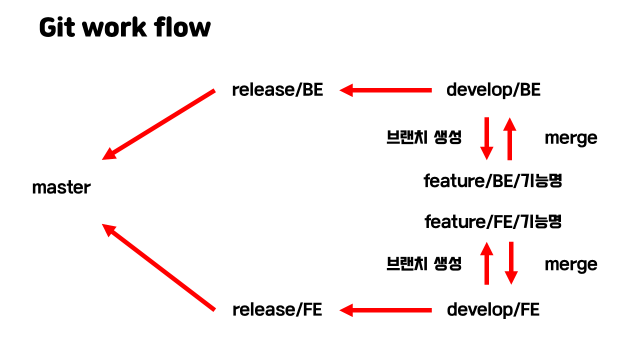
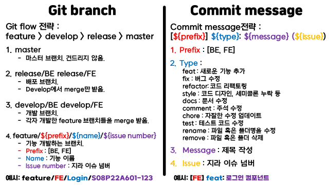

# Git 정리

학습 후기 : **첫 형상관리 툴을 학습하며 정말 효율적인 방식임을 느꼈다. 버전 관리를 S-folder에서 정리하였는데 이런식으로 문서화하는 것이 좋다고 생각해서 정리한다.**

## WHY?

- 일단 remote에 보관이 가능하며, 변동사항 추적이 용이하여 협업에 굉장히 유리하다.
- PR을 진행하다가도 변동사항을 추적하여 원하는 상태로 변경하기 좋음.

## WHAT?

- 분산 버전 관리 프로그램.
- 변동 사항 추적 및 버전 관리, 협업에 용이하다.
- 변동사항을 Working Directory, Staging Area, Repository로 나눠 관리한다.
- WD의 경우 당연히 일하는 공간이고, Staging Area는 저장하려는 변경사항, Repo는 Commit이 적용된 상태의 공간이다.

- **local과 remote 개념**

1. 말 그대로 local, 내 컴퓨터에서 작업하는 레포지토리와
2. remote, 원격에 저장된 폴더를 의미한다.
3. `git remote add origin {remote_repo}` 해당 cli를 통해 만들 수 있다.

- **branch 개념**

0. 브랜치는 깃의 꽃이다. 마스터 커밋, 커밋 히스토리를 건드리지 않고 보존한 상태에서 이어 개발이 가능하다. 독립 공간을 형성하기에 원본에 대한 안전을 보장하며, 브랜치로 나눠 진행되므로 체계적인 개발이 가능하다.
1. branch는 일종의 포인터이다.
2. 헤드로 커밋을 가리키고 있으며, 언제든 헤드를 옮겨 갈 수 있다.
3. 헤드마다 가진 변경사항을 merge 할 수도 있다.

- **merge 개념**

1. merge의 종류는 fast forward와 three way merge 방식이 존재.
2. fast forward는 빠르게 앞으로 당기는 머지.
3. three way merge는 가지가 갈라진 상태일 때 커밋을 종합해 새 커밋을 만들며 merge 한다.

- **fork 개념**

1. 오픈소스 프로젝트와 같이 자신의 소유가 아닌 원격 저장소의 경우, Fork와 pull model이 가능.
2. 원본 원격 저장소를 그대로 내 원격 저장소에 복제하는 행위.
3. 기능 완성 후 복제한 내 원격 저장소에 push한 이후, pull request를 통해 원본 원격 저장소에 반영 될 수 있도록 요청 가능.

## HOW?

- 현재 사용하는 git flow 전략 및 commit message convention

- `git init` : 레포지토리를 git으로 관리하겠다는 명령어.
- `git add .` : 파일의 변경 사항을 Staging Area로 올린다. 예시로 모든 파일을 올리는 CLI이다.
- `git commit` : 커밋을 한다는 것이다. i 키를 통해 편집, esc 이후 :wq 입력 시 커밋 완료.
- `git push` : 변동사항을 적용한 것을 리모트로 푸쉬하는 cli.
- `git clone` : 레포지토리를 클론 받는 cli.
- `git pull` : 변동 사항을 땡겨오는 cli.
- `git status` : 현재 깃 상태를 확인하는 cli.
- `git log` : 깃 커밋 로그를 확인하는 cli. 좀 더 이쁘게 하고 싶다면 `git log --oneline --graph`를 사용하자.
- `git diff 커밋코드` : log는 변경 유무를 확인하고, diff는 실제 변경된 사항을 확인 할 수 있다. 이쁘게 보이는 옵션이 많다.
- `git config --global user.email ""` : git의 글로벌 설정을 적용하는 cli. 이메일 뿐만 아니라 name 설정도 가능하다. 커밋한 사람이 누군지 확인 가능. global 아니라 local도 가능.
- `git restore 파일명` : WD에서 작업한 파일을 이전 상태(직전 커밋 상태)로 되돌린다. untracked 파일은 안되고, 이미 git으로 버전 관리가 되고 있는 파일만 가능하다. 2.23.0 버전 이전에 사용한 `git checkout --파일명`으로도 사용이 가능하다.
- `git rm --cached` : 루트 커밋이 없는 경우 사용한다. 깃 저장소가 만들어지고 한 번도 커밋 안한 경우 사용함.
- `git commit --amend` : 커밋을 완료한 파일을 SA로 되돌린다. 두가지 기능으로 나뉨. 첫번째로, 직전 커밋의 메시지만 수정하기와 두번째로, SA에 새로 올라온 내용에 직전 커밋을 덮어쓰는 것. 첫 번째는 커밋을 수정해서 새 커밋으로 남기기에 커밋 내용 수정 및 수정 사항을 새로 커밋에 추가하고 싶을 때 사용하고, 두번째는 커밋 내려와서 SA에 있던것과 합쳐서 커밋한다. 수정 사항을 적용하기 위해 add commit을 이용 할 필요가 없다는 장점이 있다.
- `git restore --staged` : 루트 커밋을 한 경우(한 번이라도 커밋 기록이 있는 경우) 사용한다. SA에 있는 변동 사항을 다시 WD로 빼온다. 이전 버전에서는 `git reset HEAD 파일명`
- `git revert 커밋ID` : 레포를 이전 커밋 상태로 되돌릴 때 쓰인다. revert는 커밋을 취소한다. revert의 경우, 커밋을 없앤다는 커밋을 남기며 현재 상태의 커밋 상태로 새로 갱신된다. revert의 경우, 협업에 좋다.
- `git reset --옵션 커밋ID` : 레포를 이전 커밋 상태로 되돌릴 때 쓰이며, revert와 다른 점은 헤드를 이동시켜서 커밋을 없앴다는 커밋을 생성하지 않는다. 옵션으로는 soft, mixed, hard를 선택한다. 해당 커밋 이후로 쌓인 커밋들은 사라지며, 사라지는 커밋을 어떻게 할 지 옵션으로 선택한다. soft는 해당 커밋으로 돌아가고, 해당 커밋 이후의 변동 사항을 SA에 올려둔다. 커밋만 없앰. mixed의 경우, 해당 커밋으로 돌아가고, 되돌아간 커미의 경우, WD에 돌려놓는다. 기본값임. hard의 경우, 완전히 WD에서도 삭제한다. 하지만 untracked 파일은 사라지지 않는다.
- `git branch 이름` : 브랜치 생성
- `git branch -r` : 리모트 브랜치 확인
- `git branch -d 브랜치이름` : 브랜치 삭제. 병합된 브랜치만 가능. -D 옵션을 주면 강제 삭제.
- `git switch 브랜치이름` : 브랜치 이동.
- `git switch -c 브랜치이름` : 브랜치 생성 및 이동
- `git switch -c 브랜치이름 커밋아이디` : 특정 커밋 기준으로 브랜치 생성 및 이동
- `git merge 브랜치이름` : 현재 브랜치에 입력한 브랜치를 병합
- `git checkout -t origin/브랜치명` : 리모트 브랜치를 로컬로 가져온다.
- `git push origin --delete 브랜치명` : 리모트 브랜치 삭제

- 대표적인 git flow 방식들

1. git-flow
   깃 플로우는 5개의 브랜치로 나눠져 있다.
   master(본버전, 항상 돌아가야 한다.) / hotfixes (핫픽스) / release branches (테스트 하는 곳.) / develop (개발 브랜치) / feature branches (여러개 맘껏 만들어서 사용하여 기능 개발.)

최종때 git-flow 할 일 많이 없다. 큰 회사에서나, 엄격하게 코드 관리 할 때만 쓴다. 니들은 이렇게 하면 브랜치 관리하다 시간 다 날린다.

2. github-flow

- 복잡한 깃플로우를 개선해서 깃헙에서 사용하는 방식.
- master / feature 두개 브랜치만 쓰는 것이다.
- Pull Request 기능을 사용하도록 권장하며 병합 후 배포가 자동화로 이루어짐.
- 소규모한 곳에서 많이 쓴다.

3. gitlab-flow

- master production pre-production 세가지 사용.
- 마스터에서 작업을 다 하고, 프로덕션으로 배포하기 전에 pre-production에서 실험하고 프로덕션으로 배포.

## WHAT IF?

- 버전 관리와 변경 기록 추적이 용이해진다.
- 원본을 보존한 채로 작업을 할 수 있으며, 원본에서 갈라져 나온 브랜치이기에 협업에서 좋다.

## 참고하여 추가 정리 할 링크

https://www.atlassian.com/ko/git/tutorials/rewriting-history
